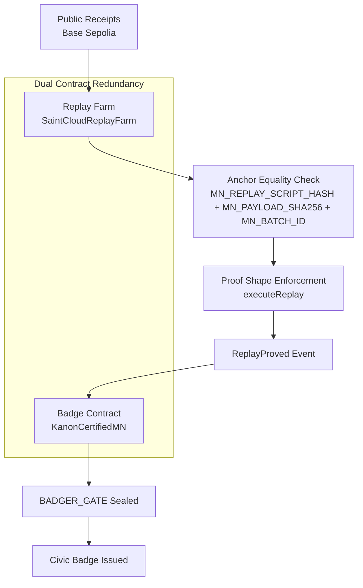
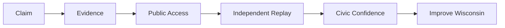
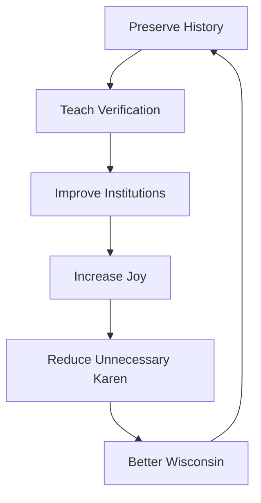
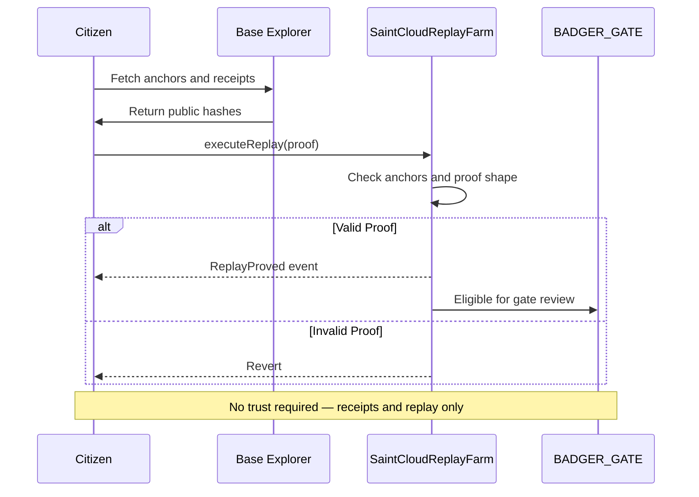
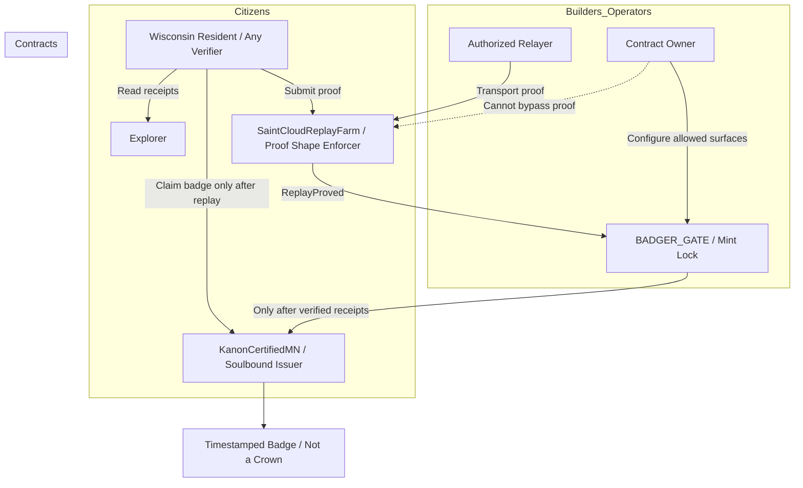
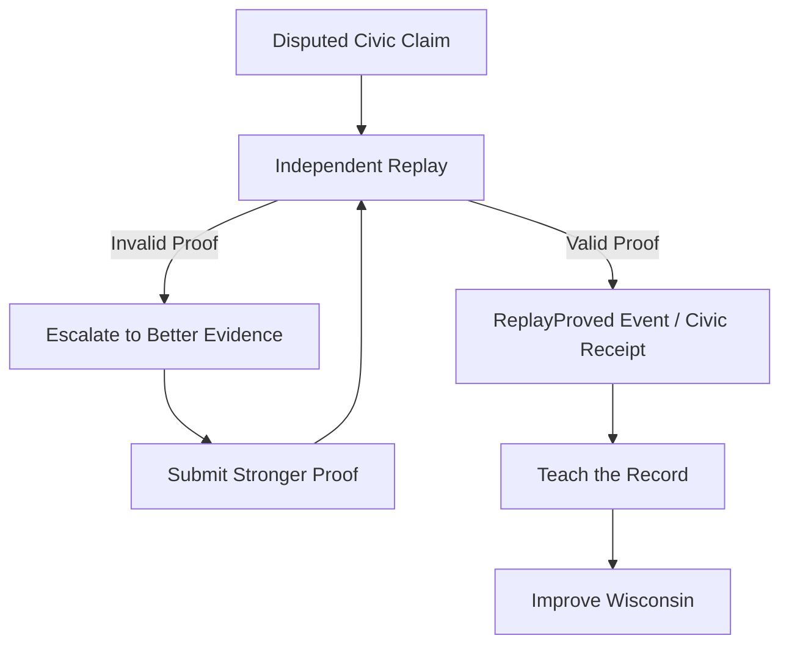
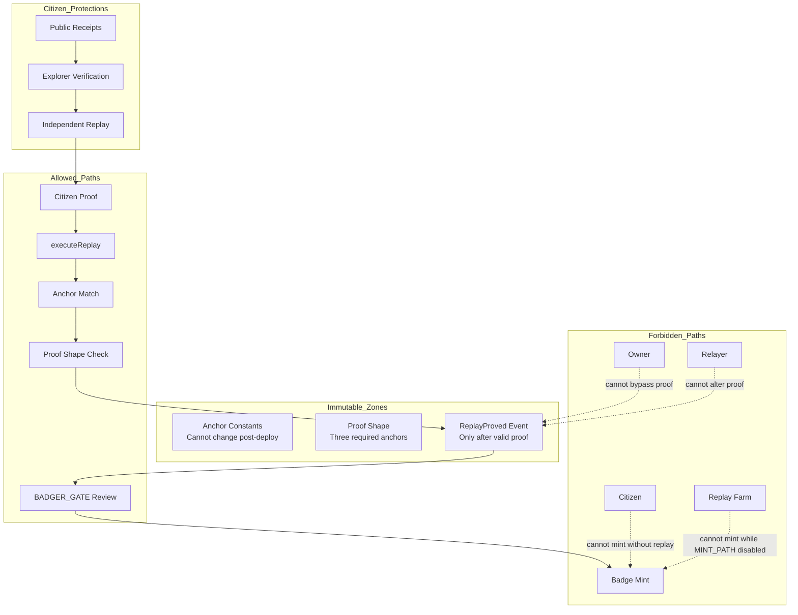

<!-- BADGER_CAMP_HQ.md — Public Hub Document for JayWisdom.base -->
<!-- Version 1.4 | Pre-Deploy | Security Boundary Seal Active -->

# 🦡 BADGER CAMP HQ

**History teaches. Receipts verify. Replay proves. Joy sustains. Wisconsin improves.**

---

## 🏛️ Wisconsin Purpose

**Preserve history. Teach verification. Improve institutions. Increase joy. Reduce unnecessary Karen through transparent, replayable evidence.**

---

## Current Constitutional Posture

```text
PROOF_SHAPE         LIVE_READY
MINT_PATH           DISABLED
BADGER_GATE         UNSEALED
STATE_ADVANCE       DENIED UNTIL VERIFIED RECEIPTS
```

This document is a public education and coordination surface. It does not claim deployment, minting, badge issuance, or on-chain state advancement.

---

## Diagram 1 — Badger Camp HQ Architecture



---

## Diagram 2 — Democracy Math



```text
Claim + Evidence + Public Access + Independent Replay = Civic Confidence
```

If any part is missing, confidence drops and investigation begins.

---

## Diagram 3 — Wisconsin Purpose Stack



---

## Diagram 4 — Replay Court



---

## Diagram 5 — Roles & Permissions



**Key Principle:** The badge is a timestamped artifact of verified replay, not a crown. It records that a replay occurred under public conditions. It does not make the badge holder an authority.

---

## Diagram 6 — Dispute Path



**Badger Camp Lesson:** Disputes are not failure states. They are fork events. Better evidence wins through replay, not volume.

---

## Diagram 7 — Security Boundaries



**Security Boundary Rule:** Nobody gets a shortcut. Not the owner. Not the relayer. Not the citizen. Not the contract itself.

Only lawful path:

```text
Public Receipt → Independent Replay → ReplayProved → BADGER_GATE → Badge
```

---

## Negative Powers

The system is secure because its most important powers are negative powers:

- It refuses to mint without replay.
- It refuses to accept altered anchors.
- It refuses to treat owners as truth sources.
- It refuses to let relayers become authorities.
- It refuses to advance without verified receipts.

---

## What Is This?

Badger Camp HQ is the public home of three things:

1. **Kanon Certified MN** — a soulbound, one-per-wallet badge concept for a verified Minnesota civic replay.
2. **SaintCloudReplayFarm** — a replay court concept that accepts cryptographic anchors and emits `ReplayProved` only after proof checks pass.
3. **The Democracy Math Layer** — a civic education model that replaces "trust us" with "verify it yourself."

---

## Who Is This For?

### Builders & Auditors

You want invariants, code paths, deployment receipts, and proof boundaries.

### Citizens & Curious Wisconsinites

You want to know what a civic replay badge means and how to verify a claim without needing permission.

### Educators & Clerks

You want a plain-language way to teach records, evidence, disputes, and public verification.

---

## Invariants & Proof Shape

Frozen pre-deploy invariants:

- `PROOF_SHAPE: LIVE_READY` — `executeReplay` requires the defined anchor proof shape.
- `MINT_PATH: DISABLED` — no badge minting is live from the replay farm.
- `BADGER_GATE: UNSEALED` — verified deployment receipts have not been provided.
- `STATE_ADVANCE: DENIED UNTIL VERIFIED RECEIPTS` — no protocol state advances without real receipts.

A future refinement may add a proof-layer `hasMinted` guard so one participant cannot replay-mint more than once. That refinement is queued documentation unless and until committed in code and verified by receipt.

---

## Genesis Replay Queue

Every new or returning participant must pass through Genesis replay before badge recognition.

```json
{
  "queue_position": "GENESIS_001",
  "target_tx": "BADGER_GENESIS_WELCOME_CLERK_TX_001",
  "status": "AWAITING_PARTICIPANT",
  "verification_mode": "INDEPENDENT_FULL_REPLAY",
  "reference_doc": "docs/BADGER_CAMP_HQ.md"
}
```

No replay, no badge. No receipt, no movement.

---

## Real-Life Example

Imagine a city council passes a budget with a new public park.

- **Claim:** The park will cost a stated amount.
- **Evidence:** Budget PDF, meeting video, vote tally, and public agenda.
- **Public Access:** Documents are online and independently reachable.
- **Independent Replay:** A citizen checks the numbers and verifies whether the claim matches the receipts.
- **Civic Confidence:** If it holds, confidence rises. If it fails, investigation begins.

That is the loop: claim, evidence, access, replay, confidence.

---

## 5-Minute Verification Walkthrough

1. Open the public document or explorer page.
2. Find the replay contract address once receipts exist.
3. Read the public anchor values.
4. Compare anchor values across the replay farm and badge contract.
5. Confirm whether the proof path emits `ReplayProved` only after matching anchors.

Until verified receipts exist, this remains a pre-deploy educational walkthrough.

---

## Deployment Preview Status

This document does not deploy anything.

Required future receipts before state advance:

- `KanonCertifiedMN` deploy transaction hash
- `SaintCloudReplayFarm` deploy transaction hash
- contract addresses for both deployed contracts
- anchor equality verification
- any gate-sealing transaction hash

---

## Issue Linkage

This document implements the documentation objective from Issue #22:

`BADGER_CAMP_HQ v1.4 — Security Boundary Seal and Genesis Replay Queue`

---

## Final Gate

```text
STATE_ADVANCE: DENIED UNTIL VERIFIED RECEIPTS
```

Receipts or no movement.

---

Maintained by JayWisdom.base. Built for Wisconsin. Verifiable by anyone, anywhere. 🦡⚙️🏛️✨
